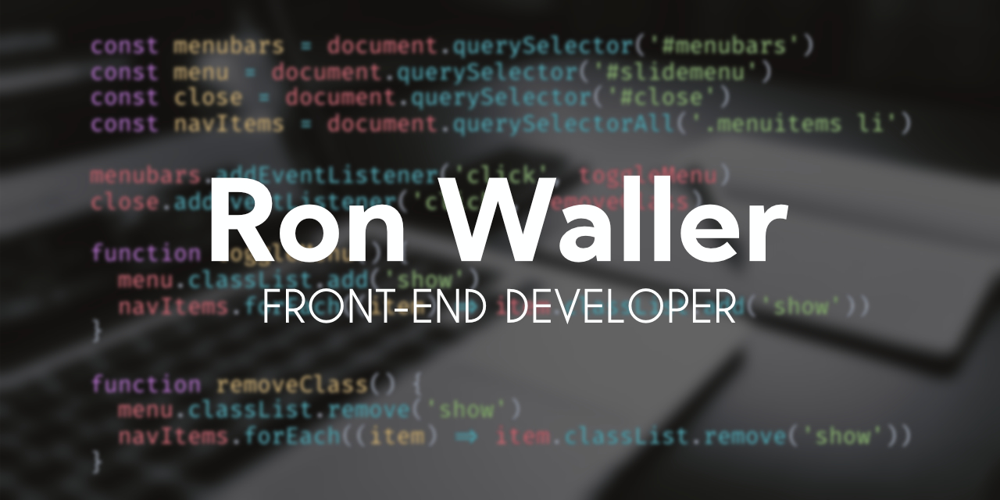

- 🔭 I’m currently working on front-end projects
- 🌱 I’m currently learning javascript
- 👯 I’m looking to collaborate on open source projects
- :date: 2022 Goals:
  - Contributing to open source projects
  - Start a blog
  - Becoming a front-end developer
- 🤔 I’m looking for help with being a better developer
- ⚡ Fun fact: I make vinyl decals and stickers

 

### Connect with me:

 

[][github]
[][twitter]
[][instagram]
[][discord]

 

### Languages and Tools:

 

---

 

  
Github Stats

  
  

[github]: https://github.com/RonWaller
[twitter]: https://twitter.com/ronjw1
[discord]: https://discordapp.com/users/360135966041571329
[instagram]: https://www.instagram.com/ronjw1/

<!-- github #181717
twitter #1DA1F2
instagram #E4405F #bc2a8d
discord #5865F2 -->
